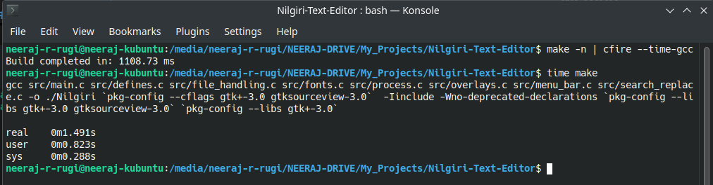

# CFIRE - Compile and Fire

A blazingly fast C program runner that compiles and executes C code entirely in memory, without writing to disk.

## Overview

CFIRE is a "Compile and Go" wrapper around GCC that leverages Linux's in-memory file system to eliminate I/O overhead. It reads a C source file (or a GCC command from stdin), compiles it to memory using `memfd_create`, and executes the compiled binary directly — all without touching your disk.

This approach is particularly useful for:
- **Rapid prototyping** - Compile and test C code without generating intermediate binary files
- **Scripting-like execution** - Run C programs similar to how you'd run scripts
- **Performance testing** - Benchmark code without disk I/O interference
- **Educational tools** - Quickly execute student submissions without file clutter
- **Makefile integration** - Pipe complex GCC commands directly from `make -n` into CFIRE

## Features

- **Zero-disk overhead**: Compiled binaries exist only in memory
- **GCC-based**: Leverages the full power of GCC's optimization and compilation
- **Direct execution**: No intermediate steps between compilation and execution
- **Clean environment**: No binary artifacts left on the file system
- **Simple interface**: Minimal command-line complexity
- **Full argument passthrough**: Pass arguments to your compiled program in both file and pipe mode
- **Makefile/pipe support**: Read full GCC commands from stdin, with automatic gcc line detection and shell expansion

## How It Works

CFIRE operates through a three-stage process:

### 1. Memory File Creation
```c
int fd = memfd_create("mem_file", 0);
```
Creates an anonymous in-memory file descriptor that behaves like a regular file but exists entirely in RAM.

### 2. Compilation in Child Process
```c
pid_t pid = fork();
// File mode: compile a single source file
execlp("gcc", "gcc", argv[1], "-o", path, NULL);

// Stdin mode: pass the full reassembled command to sh -c
execl("/bin/sh", "sh", "-c", sh_cmd, NULL);
```
A child process compiles the source code directly into the memory file. In stdin mode, the command is passed through `/bin/sh` so that shell expressions like `` `pkg-config --cflags gtk+-3.0` `` are properly expanded.

### 3. Execution via fexecve
```c
fexecve(fd, exec_argv, environ);
```
The program executes the in-memory binary using `fexecve`, which loads and runs the compiled code directly from the file descriptor.

## Architecture

```
Input C File / stdin GCC command
           ↓
  [CFIRE Main Process]
           ↓
        fork()
           ├─> [Child: sh -c / gcc]  →  Compile to memfd
           │
        waitpid()
           ↓
       [fexecve] → Execute from memfd → Output
```

## Prerequisites

- **Linux kernel** with support for `memfd_create` (Linux 3.17+)
- **GCC** compiler
- **glibc** with GNU extensions (for `_GNU_SOURCE`)

## Building

```bash
# Basic
gcc main.c -o cfire

# With optimization
gcc -O2 main.c -o cfire

# With debug symbols
gcc -g main.c -o cfire
```

## Usage

### Basic Syntax
```bash
# File mode
./cfire <source_file.c> [arguments...]

# Stdin / pipe mode
make -n | ./cfire - [arguments...]

# Interactive stdin mode
./cfire -

# Time the full compile + run cycle
./cfire --time <source_file.c>

# Time GCC compilation only (no execution)
make -n | ./cfire --time-gcc
```

### Parameters
- `<source_file.c>` - Path to the C source file to compile and execute
- `-` - Read the GCC command from stdin (pipe or interactive)
- `--time` - Time the full compile + execute cycle; works like file mode but prints elapsed time
- `--time-gcc` - Read a GCC command from stdin (like `-`), compile only, print build time in milliseconds, and exit without executing
- `[arguments...]` - Optional arguments passed to the compiled program. Works in both file and pipe mode.

---

## Examples

### Simple Hello World
```c
// hello.c
#include <stdio.h>
int main() {
    printf("Hello from CFIRE!\n");
    return 0;
}
```
```bash
./cfire hello.c
# Hello from CFIRE!
```

### Program with Arguments
```c
// greet.c
#include <stdio.h>
int main(int argc, char *argv[]) {
    printf("Hello, %s!\n", argc > 1 ? argv[1] : "World");
    return 0;
}
```
```bash
./cfire greet.c Alice
# Hello, Alice!
```

### Passing Arguments in Pipe Mode
```bash
make -n | ./cfire - arg1 arg2
```
Arguments after `-` are passed through to the compiled binary in exactly the same way as file mode.

---

## Makefile / Pipe Integration

CFIRE supports reading a full GCC command from stdin using the `-` argument. This allows seamless integration with `make -n` (dry-run mode), which prints the commands a Makefile would execute without running them.

### Basic Usage
```bash
make -n | ./cfire -
```

That's it — no `grep` needed. CFIRE internally scans stdin line by line until it finds a line beginning with `gcc`, so any `make` status messages, directory notices, or other output are automatically skipped.

### How stdin Scanning Works

Rather than reading just the first line, CFIRE loops through stdin:
```c
int found = 0;
while (fgets(cmd_buf, sizeof(cmd_buf), stdin)) {
    if (strncmp(cmd_buf, "gcc", 3) == 0) {
        found = 1;
        break;
    }
}
```
This means output like this from `make -n` is handled cleanly:
```
make[1]: Entering directory '/some/path'
gcc src/main.c src/foo.c -o myprogram `pkg-config --libs gtk+-3.0`
make[1]: Leaving directory '/some/path'
```
CFIRE skips the first and last lines and picks up the gcc line automatically.

### Shell Expression Expansion

The GCC command from `make -n` often contains backtick subshells, for example:
```
gcc src/main.c `pkg-config --cflags gtk+-3.0` -o myprogram
```
CFIRE passes the reassembled command through `/bin/sh -c` so these are properly expanded by the shell before GCC runs — exactly as they would be in a terminal or Makefile.

### -o Flag Handling

CFIRE automatically strips any existing `-o <outfile>` from the piped command and replaces it with `-o /proc/self/fd/<fd>` pointing to the in-memory file. You never need to manually remove it.

So this command from `make -n`:
```
gcc -O2 -Wall src/main.c src/foo.c -o myprogram `pkg-config --libs gtk+-3.0`
```
Becomes this internally:
```
gcc -O2 -Wall src/main.c src/foo.c `pkg-config --libs gtk+-3.0` -o /proc/self/fd/3
```

### Interactive Stdin Mode

If you run `./cfire -` without a pipe, CFIRE detects that stdin is a terminal and shows a prompt:
```
cfire> 
```
You can then type a GCC command manually and hit Enter:
```
cfire> gcc file1.c file2.c
```
CFIRE will compile and execute it exactly as if it came from a pipe. This works because `fgets` on stdin simply blocks until input is available, whether that input comes from a pipe or a human typing.

### Timing Flags

CFIRE includes a flag for measuring build performance.

**`--time-gcc`** reads a GCC command from stdin (exactly like `-`), compiles it, prints the build time in milliseconds, and exits without executing the binary. This is useful for benchmarking compilation speed in isolation.

```bash
make -n | ./cfire --time-gcc
# Build completed in: 1108.73 ms
```

The flag use's `CLOCK_MONOTONIC` for high-resolution timing unaffected by system clock adjustments.

---

## Performance: CFIRE vs `make` — Nilgiri Text Editor

The [Nilgiri Text Editor](https://github.com/neeraj-r-rugi/Nilgiri-Code-Editor) is a GTK3/GtkSourceView project built from multiple source files with several `pkg-config` dependencies. It makes a good real-world benchmark for comparing CFIRE's pipe mode against a direct `make` invocation.

| Method | Time |
|---|---|
| `make -n \| cfire --time-gcc` | **1108.73 ms** |
| `time make` (real) | **1491 ms** |

CFIRE completes the same build roughly **~25% faster** than `make` in this case. The difference comes from eliminating disk writes for the output binary — everything stays in RAM.

> 

The Nilgiri build command that CFIRE processes via `make -n`:
```bash
gcc src/main.c src/defines.c src/file_handling.c src/fonts.c src/process.c \
    src/overlays.c src/menu_bar.c src/search_replace.c \
    -o ./Nilgiri \
    `pkg-config --cflags gtk+-3.0 gtksourceview-3.0` \
    -Iinclude -Wno-deprecated-declarations \
    `pkg-config --libs gtk+-3.0 gtksourceview-3.0` \
    `pkg-config --libs gtk+-3.0`
```

Shell backtick expansion, multi-file compilation, and external library flags are all handled transparently by CFIRE's stdin/pipe mode.

Sure, you can add this line right after the timing comparison:

> ⚠️ *Note: CFIRE's speed advantage applies to **full rebuilds only** — unlike `make`, it has no incremental build support and recompiles everything on every run.*
---

## Binary Name Warning

> ⚠️ **The compiled binary's `argv[0]` will always be `cfire_build`, regardless of how you invoke CFIRE.**

When CFIRE executes the compiled binary via `fexecve`, it explicitly sets `argv[0]` to `"cfire_build"`. This is intentional — since the binary exists only in memory with no file path, there is no meaningful name to derive automatically. The kernel does not fill in `argv[0]`; whatever the calling process provides is what the binary sees.

This means if your program uses `argv[0]` in usage messages:
```c
fprintf(stderr, "Usage: %s <input>\n", argv[0]);
// Will print: Usage: cfire_build <input>
```

This is a known and accepted trade-off of in-memory execution. If you need the correct binary name, hardcode it or pass it as a separate argument.

---

## PANIC Error Reference

CFIRE outputs errors prefixed with a red `CFIRE PANIC:` message to stderr. All panics exit with code 1.
>Note: Passing `--panic` as the first argument to CFIRE, invokes PANIC, and terminates program.

example:
```
./cfire --panic
```

| PANIC Message | Cause | Resolution |
|---|---|---|
| `No input file or Makefile argument '-' provided.` | CFIRE was run with no arguments. | Provide a `.c` source file or `-` for stdin mode. |
| `Failed to create in-memory file.` | `memfd_create()` failed. | Ensure Linux kernel 3.17+ is in use. Check `uname -r`. |
| `Failed to read command from stdin.` | `-` mode was used but stdin was empty or closed with no input. | Ensure the pipe produces output, or type a command in interactive mode. |
| `No gcc command found in stdin.` | stdin was read fully but no line starting with `gcc` was found. | Check that `make -n` produces a gcc command, or verify your piped input. |
| `GCC Compilation failed.` | GCC exited with a non-zero status. GCC's own errors will appear above this. | Fix compilation errors in your source. |
| `Failed to execute compiled program.` | `fexecve()` failed after successful compilation. | Ensure the memfd is valid and the kernel supports `fexecve`. |
|`PANIC FLAG ACTIVE`|Flag `--panic` was passed explictly|Remove `--panic` and execute

---

## Technical Details

### System Calls Used

| System Call | Purpose |
|------------|---------|
| `memfd_create()` | Create anonymous in-memory file |
| `fork()` | Create child process for compilation |
| `execlp()` | Execute GCC in child process (file mode) |
| `execl("/bin/sh")` | Execute shell in child process (stdin/pipe mode, enables backtick expansion) |
| `waitpid()` | Wait for compilation to complete |
| `fexecve()` | Execute compiled binary from file descriptor |

### Memory File Descriptor Path

The compiled binary is written to `/proc/self/fd/<fd>` — a procfs symlink to the anonymous memfd. GCC treats it as a normal output path and writes the binary directly to memory.

### Argument Passthrough

Arguments after the source file or `-` are forwarded to the compiled binary starting from `argv[2]`:
```c
char *exec_argv[256];
exec_argv[0] = "cfire_build";
for (i = 2; i < argc; i++)
    exec_argv[i-1] = argv[i];
exec_argv[i-1] = NULL;
fexecve(fd, exec_argv, environ);
```
This works identically in both file mode and stdin/pipe mode.

---

## Performance Considerations

- **No disk I/O** for compilation artifacts
- **Faster iteration** during development
- **Reduced SSD wear** from frequent read/write cycles
- **No cleanup** needed after execution

---

## Comparison with Traditional Execution

### Traditional GCC Approach
```bash
gcc source.c -o binary && ./binary arg1 arg2 && rm binary
```
Three commands, binary on disk, manual cleanup.

### CFIRE File Mode
```bash
./cfire source.c arg1 arg2
```
One command, nothing on disk.

### CFIRE Makefile Mode
```bash
make -n | ./cfire - arg1 arg2
```
Full Makefile GCC command, multi-file builds, shell expansion — nothing on disk.

---

## Limitations

1. **No Binary Persistence**: Recompiles every run. Best for fast iteration on small-to-medium codebases.
2. **GCC Overhead**: Compilation time is incurred on every invocation.
3. **Memory Constraints**: Very large binaries consume RAM. Monitor usage for complex programs.
4. **Linux-Only**: Requires `memfd_create` and `fexecve`. Does not work on macOS or Windows.
5. **Single GCC Command**: Stdin mode picks the first `gcc` line. Multi-step builds (separate compile + link) are not supported.
6. **Binary Name is Always `cfire_build`**: See Binary Name Warning above.

---

## Advanced Usage

```bash
# Time only the GCC compilation step (pipe mode, no execution)
make -n | ./cfire --time-gcc

# Time the full compile + run cycle
./cfire --time program.c arg1 arg2

# Time with the system time command for comparison
time ./cfire program.c arg1 arg2

# Capture output
./cfire program.c > output.txt 2>&1

# Pipe data to the compiled program
echo "input data" | ./cfire program.c

# Makefile build with arguments passed to binary
make -n | ./cfire - inputfile.txt

# Interactive mode — type a gcc command at the prompt
./cfire -
```

---

## Building from Source

```bash
cd /path/to/cfire
gcc -O2 main.c -o cfire
```

---

## License

GNU GPLv3

## Contributing

This is a student project meant to enhance personal workflow. Do not expect frequent updates.

## Future Enhancements

- **Compiler selection**: Support Clang, TCC, etc.
- **C++ support**: Extend to C++ via g++
- **Binary caching**: Skip recompilation if source hasn't changed
- **Multi-command Makefile support**: Handle separate compile/link steps
- **Configurable binary name**: Allow overriding `cfire_build` via a flag
- **Compilation flags**: Pass custom GCC flags via CLI

## References

- [memfd_create(2)](https://man7.org/linux/man-pages/man2/memfd_create.2.html)
- [fexecve(3)](https://man7.org/linux/man-pages/man3/fexecve.3.html)
- [execl(3)](https://man7.org/linux/man-pages/man3/exec.3.html)
- [GCC Manual](https://gcc.gnu.org/onlinedocs/gcc/)

---

**CFIRE** - Compile, Fire, Forget